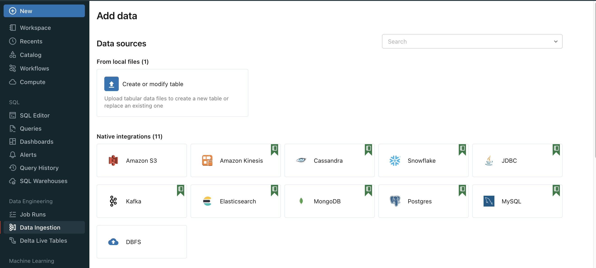
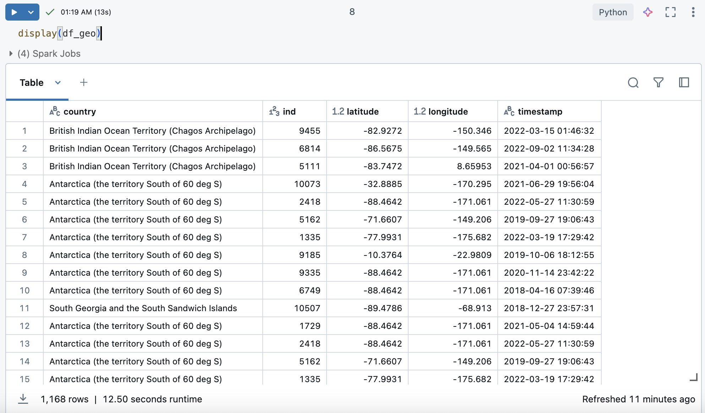
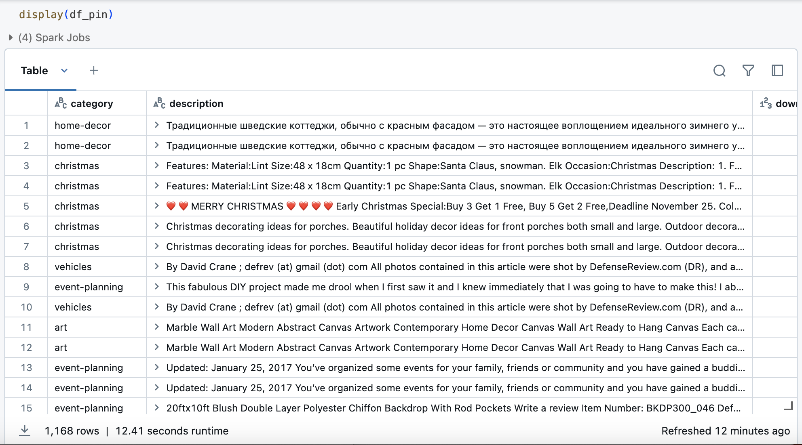
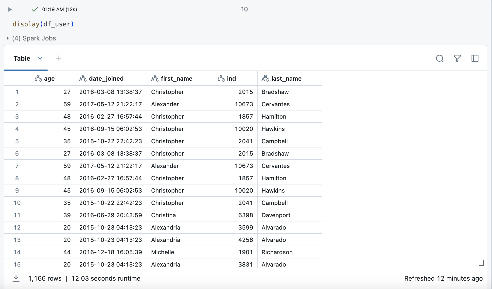

# Pinterest data pipeline

## A description of the project: what it does, the aim of the project, and what you learned
This project aims to simiulate the process of data ingestion and data processing of social media data using AWS data engineering services

## Installation instructions
You would need an aws account to set up this pipeline.

To set up your EC2 enviroment, you would need to generate a key pair (this is stores as a .pem file) and use this to connect with the ec2 **securely**.

Due to security reasons we need to make this file private. To do this, navigate to where the .pem and run the following command in terminal.

```bash
chomd 400 "your_private_key.pem"
```

Then run this:

```bash
ssh -i /path/key-pair-name.pem instance-user-name@instance-public-dns-name
```

You'll have to create your own MSK cluster on AWS.

To download kafka (ensure that the kafka file is the same veirson as the IAM MSK authenticator):

```bash
wget https://archive.apache.org/dist/kafka/2.8.1/kafka_2.12-2.8.1.tgz
tar -xzf kafka_2.12-2.8.1.tgz
```

Install ````IAM MSK authentication package``` into your EC2 client


configure your EC2 client using AWS IAM for for cluster authentication and your client.properties inside your kafka folder.

Create custom plugins using MSK Connect in order to data to automatically stored and saved into aws s3 bucket.

Create a connector using using MSK Connect for ore info: 


**to be continued**

### Loading the s3 data onto Databricks

Important: this stage is not avaliable for Databricks Community Edition account

1. retrieve the access and secret key from AWS IAM. You should receieve a CSV file containing this information.

2. Then load said csv file to databricks using databrick UI as seen below.




3. get the path to the csv file, read the Delta table to a Spark DataFrame

4. extract the access key and secret access key from the spark dataframe and encode the secret access key.

5. mount the aws bucket to databricks and where to mount it to using ```dbutils.fs.mount()```. this is done once and can be retieved any time

6. find desired data and load it as a spark dataframe by reading the data.

End result: 3 spark dataframes are formed.

**df_geo**


**df_pin**


**df_user**



## Usage instructions

run 

```bash
./env_setup_for_pip_users.sh
```

## File structure of the project
```
.
├── README.md
├── creds
│   ├── 1232252d77df-key-pair.pem
│   ├── credential.yaml
│   └── important.txt
└── user_posting_emulation.py

2 directories, 5 files
```
## License information